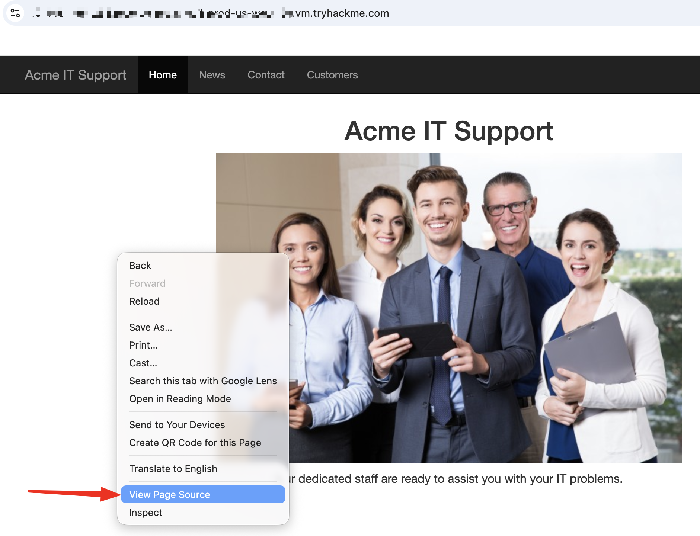
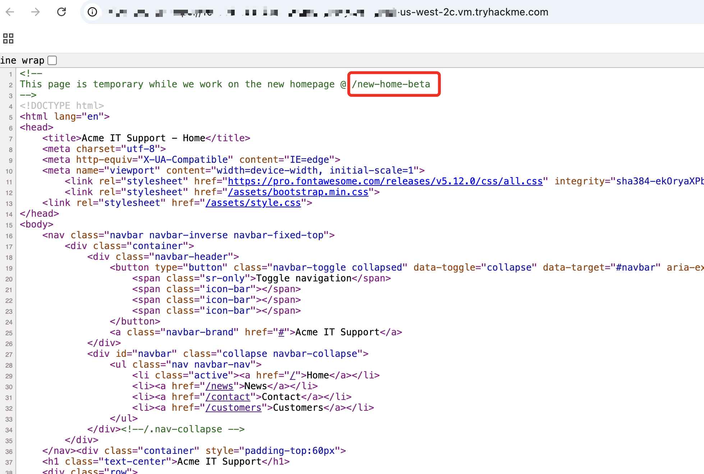
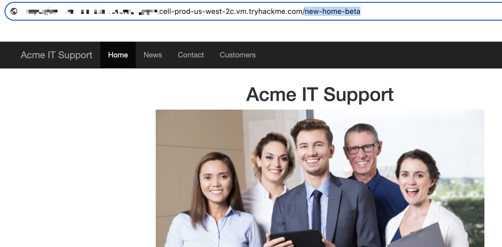
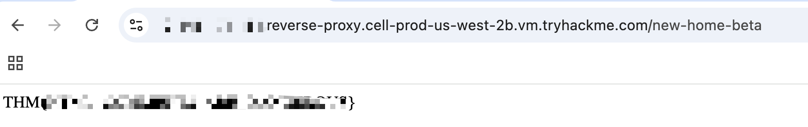
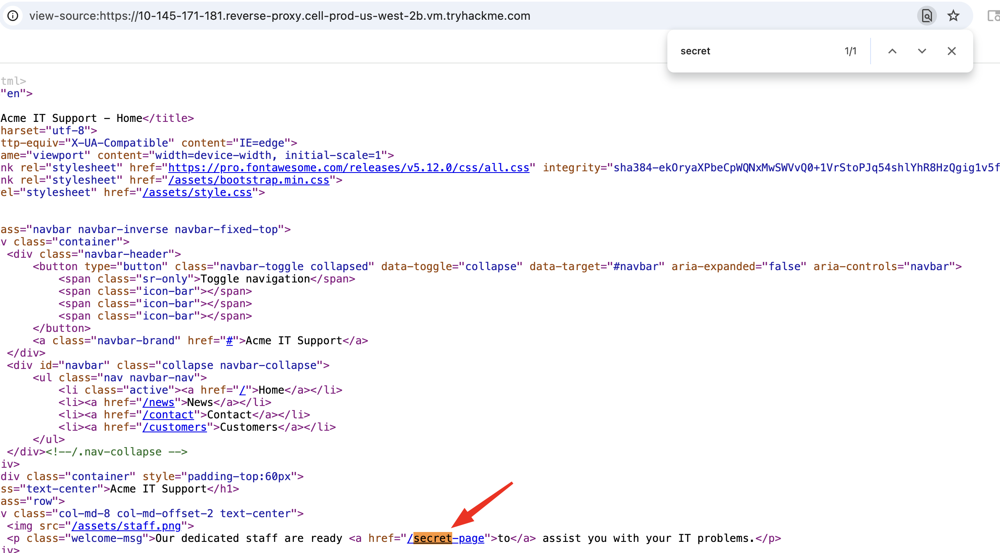
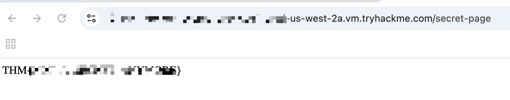

# 🌐 Walking An Application — Page Source Viewing
**Platform:** TryHackMe  
**Path:** Jr Penetration Tester → Web Hacking  
**Status:** ✅ Completed 
__________
## 🎯 Objective
Learn how to manually review a web application for vulnerabilities 
using only a browser's built-in developer tools.

__________

## 🧠 Key Concepts Learned
- Page source is the human-readable code returned by the web server
- Page source is made up of HTML, CSS, and JavaScript
- Viewing page source can reveal hidden comments, credentials, 
  and hidden endpoints

___________
## 🎯 Target
**ACME Website** — used as the practice target for this room
_____________
 

In this activity, We have four questions :

1. What is the flag from the HTML comment?
2. What is the flag from the secret link?
3. What is the directory listing flag?
4. What is the framework flag?

___________________
## ❓ Tasks & Solutions

### Task 1 — What is the flag from the HTML comment?

**Approach:**
- Opened page source in Google Chrome on Mac (`Cmd + U`)
- Searched for HTML comments using `Cmd + F` and typing `<!--`
- Found a clue left in the comment section
- Manually Adding the suspected directory to the URL

**Flag 1:** `THM{REDACTED}` ✅

--------------------------

### Task 2 — What is the flag from the secret link?

**Approach:**
- Searched for the word "secret" via `Cmd + F` 
- Found a match and clicking it

 

**Flag 2:** `THM{REDACTED}` ✅

### Task 3 — What is the directory listing flag??

**Approach:**
- Inspect the webpage via inspection tool
- Discovered "assets" folder via sources tab
- Manually adding "assets" to the URL
- Discovered different files including flag.txt
- clicking flag.txt

**Flag 3:** `THM{REDACTED}` ✅

